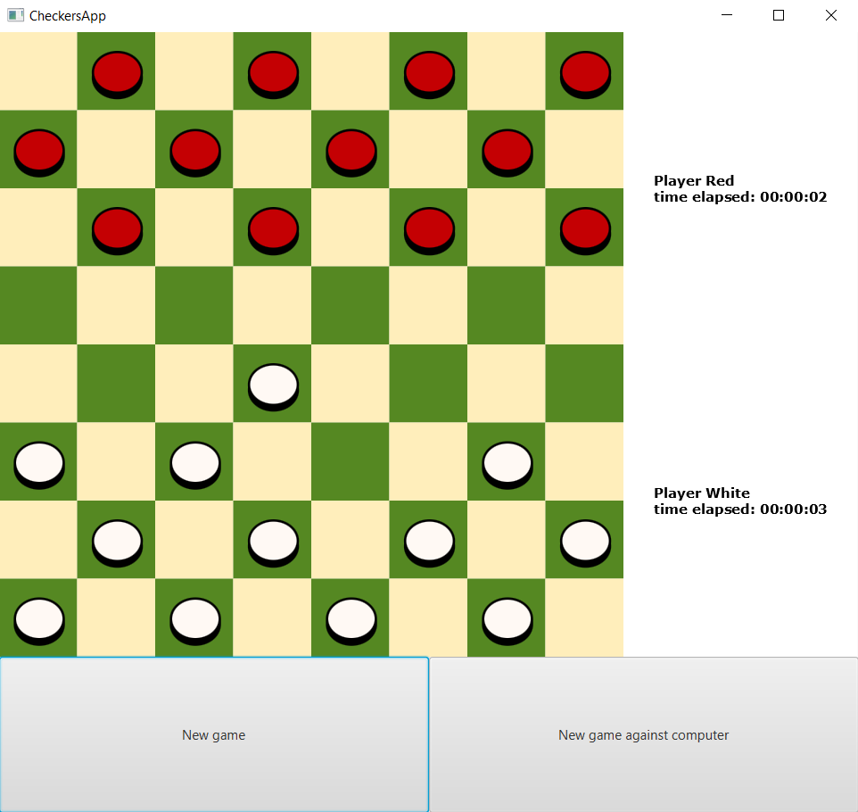

# Checkers project

Hello there, this is my small checkers app made for my objective programming classes.

## Libraries Used

- JavaFx

## Setup 

Please note, that this is not a standard java project, therefore simple compilation won't work. First you have to have javafx installed. Then you can refer to [this](https://openjfx.io/openjfx-docs/#install-javafx). This is how the application looks: 

## Credits

The apps code is based on a template checkers app written by [Almas Baimagambetov](https://www.youtube.com/channel/UCmjXvUa36DjqCJ1zktXVbUA). His template repo can be found [here](https://github.com/AlmasB/FXTutorials/tree/master/src/main/java/com/almasb/checkers).
